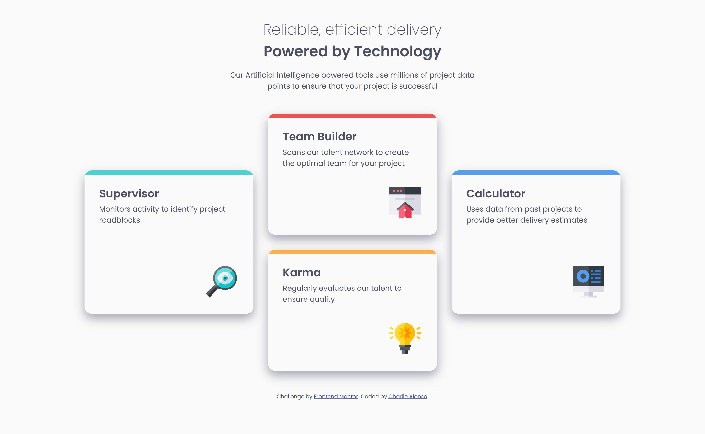

# Frontend Mentor - Four card feature section solution

This is a solution to the [Four card feature section challenge on Frontend Mentor](https://www.frontendmentor.io/challenges/four-card-feature-section-weK1eFYK). Frontend Mentor challenges help you improve your coding skills by building realistic projects. 

## Table of contents

- [Frontend Mentor - Four card feature section solution](#frontend-mentor---four-card-feature-section-solution)
  - [Table of contents](#table-of-contents)
  - [Overview](#overview)
    - [The challenge](#the-challenge)
    - [Screenshot](#screenshot)
    - [Links](#links)
  - [My process](#my-process)
    - [Built with](#built-with)
    - [What I learned](#what-i-learned)
    - [Useful resources](#useful-resources)
  - [Author](#author)

## Overview

### The challenge

Users should be able to:

- View the optimal layout for the site depending on their device's screen size

### Screenshot

### Links

- Solution URL: [Four-card-feature-section-challege git repository](https://github.com/Charlie025x/Four-card-feature-section-challenge-hub)
- Live Site URL: [https://charlie025x.github.io/Four-card-feature-section-challenge-hub/](https://charlie025x.github.io/Four-card-feature-section-challenge-hub/)

## My process

### Built with

- Semantic HTML5 markup
- Flexbox
- CSS Grid
- Mobile-first workflow
- SASS

### What I learned

I 1. gained a deeper understanding of CSS Grid's Explicit and Implicit grid systems, along with how to move grid cells and merge cells together, 2. put the ":before" and ":after" selectors into practice, 3. confirmed my understanding of "position: relative" and "position: absolute" is now correct. 4. set color values to varibles

### Useful resources

- [watch changes in sass, stackoverflow](https://stackoverflow.com/questions/18427849/how-to-watch-changes-in-whole-directory-folder-containing-many-sass-files) - This helped me get sass running
- [Using css custom properties, mozilla](https://developer.mozilla.org/en-US/docs/Web/CSS/Using_CSS_custom_properties) - Helped me set the colors to varibles, doing this made placing colors more convenient.
- [image with after selector, css-tricks](https://css-tricks.com/forums/topic/image-with-after-issue/) - I was wondering if I could add an image using by setting a background image to an "after" selector's content. Turns out it could be done.
- [The Explicit and Implicit grid explained by Kevin Powell, youtube](https://www.youtube.com/watch?v=cMWnIX3ukLI) - The most useful resource for this project. This video was my basis for writeing my CSS Grid. Kevin Powel explains how the implicit and explicit grid works, so when your grid acts weird ( which I can almost garantee it will) during codeing. You will be able to better trouble shoot why. It also taught me how to move a grid cell and change the grid's reaction to that cell moving (very usefull when writing my grid in the desktop media query).

## Author

- Website - [Charlie Alonso](https://charlie-alonso.netlify.app/)
- GitHub - [Charlie025x](https://github.com/Charlie025x)
- Frontend Mentor - [@Charlie025x](https://www.frontendmentor.io/profile/Charlie025x)